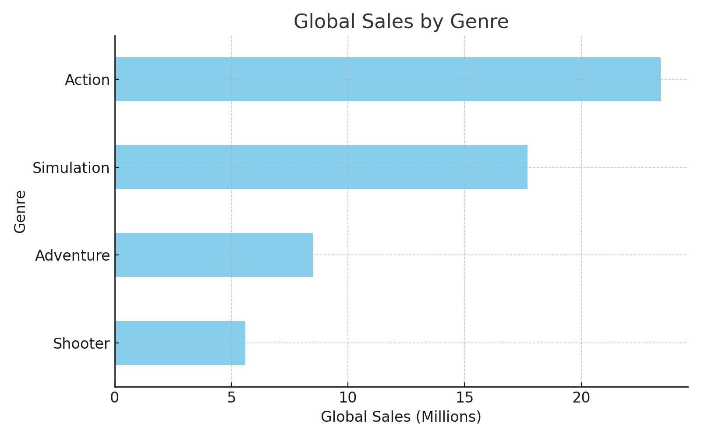

# 🎮 Video Game Sales & Ratings Analysis (1980–2023)

## 📊 Overview
This project analyzes global video game sales and ratings from 1980 to 2023 using **SQL**, **Excel**, and **Tableau**. The goal is to uncover key trends across genres, platforms, and regions, and present the findings in a visual and accessible format.

---

## 📁 Files Included
- `vgsales_raw.csv` – Original dataset from Kaggle  
- `vgsales_cleaned.xlsx` – Cleaned and formatted version used in analysis  
- `SQL_queries.sql` – SQL queries used for insights and exploration  
- `dashboard.png` – Tableau dashboard screenshot summarizing results  

---

## 🛠️ Tools Used
- **Excel** – Data cleaning and preparation  
- **SQL** – Querying structured insights from the dataset  
- **Tableau** – Building dashboards and visual storytelling  
- *(Simulated Tableau dashboard preview below)*

---

## 📈 Key Insights
- **Top genres**: Action and Adventure dominate global sales  
- **Best platforms**: PlayStation and Nintendo Switch lead in total units sold  
- **Regional trends**: North America consistently outpaces Europe and Japan  
- **Ratings impact**: Higher critic and user scores often align with top-selling titles  

---

## 📊 Tableau Dashboard
The dashboard below was built using Tableau and summarizes major trends by genre, platform, and region.

---

## 🔗 Dataset Source
Dataset originally sourced from Kaggle:  
[Popular Video Games 1980 - 2023 (Kaggle)](https://www.kaggle.com/datasets/arnabchaki/popular-video-games-1980-2023)

---

## 🧠 Skills Demonstrated
- Data wrangling in Excel  
- SQL for exploratory analysis and reporting  
- Visual storytelling with Tableau  
- GitHub project organization and documentation  

---

💬 *This project is part of my data analytics portfolio. Feedback is welcome!*
